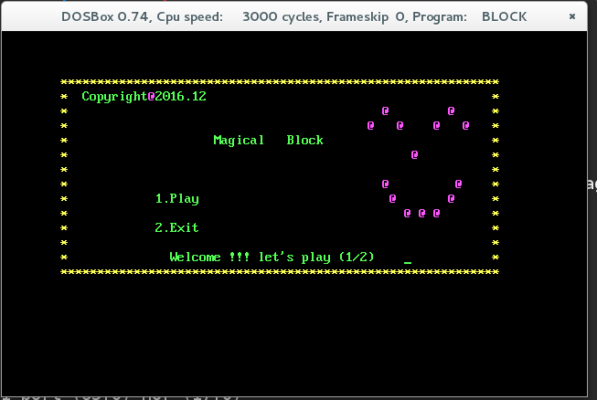
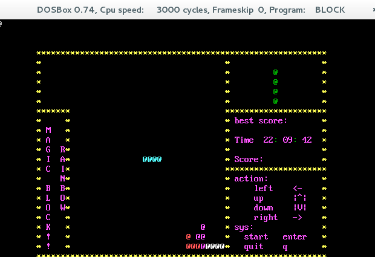
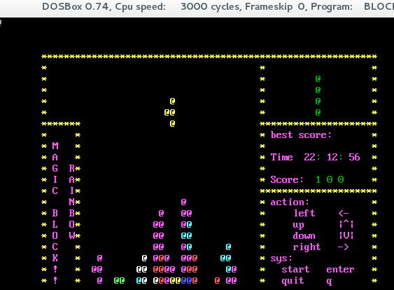
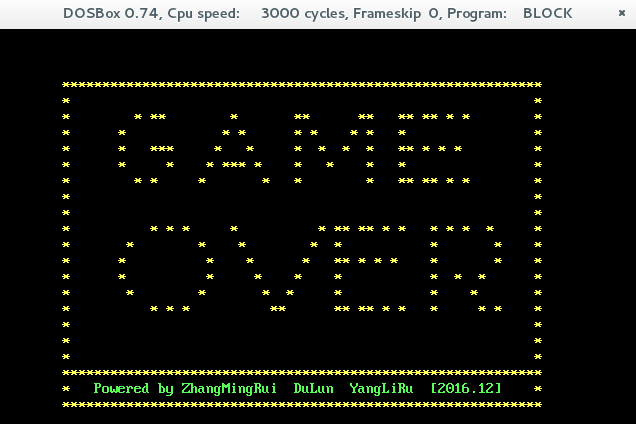

# Tetris_asm
汇编语言实现“俄罗斯方块”游戏
使用8086汇编语言实现的俄罗斯方块游戏

## 需求描述
俄罗斯方块的所有功能

1. 控制方块的移动，加速，变形等。

2. 行满则消除行，计算分数。

3. 记录分数到文件，保存存档。

4. 游戏结束。

## 功能描述
2、模块功能说明

（1）游戏模块

1.屏幕的绘制
在屏幕的绘制中，首先应该修改屏幕的颜色，其次要定义一个方块类，将生成的小方块放入其中。将前景色和背景色设置为同一种颜色，一个字符显示在屏幕上就是一个小方块。

2、时间的控制
控制方块的下落速度是设计中必须实现的功能，方块的下落速度也就是时间间隔，因此我们只需定义一个时间类，设置好时间间隔即可。同时，也需要控制屏幕的刷新速度，而刷新速度必须比方块下落时间间隔快。因此，如何在一个程序中体现两种不同的时间控制是此模块的一个难点

3、键盘的读取
我们需要对键盘中上、下、左、右键的读取实现对方块的变形、下落、右移和右移的功能。

4、数据的处理   
我们主要对三个数据进行处理。  

（1）方块的下落，相应键盘：需要判断下键是否按下，并加快时钟周期。完成下落后，还原到原来的时钟周期。

（2）形状的下落, 实现旋转：不同旋转角度显示不同方向的方块来完成的。

（3）消去主游戏区底部填满的行：查看主游戏区底部的每行是否填满的方式是，在游戏区图形框可以看成是由许多的小方块组成，方块运动的过程就是造型里方块显示或者隐藏，就像现在的霓虹灯效果一样，由时钟控件控制改变的速度，上一层的消失，下一层的显示，这样，从视觉效果可以看到方块的下落运动效果。
	
	方块在下落的过程中会自动判断每一行方块的属性，如果此行方块属性全部为是时，就会将这一行小方块的visible属性全部变成否, 同
	时消去此行，在将上面的小方块向下移动，利用循环语句进行判断，将所有这样情况的行改变小方块属性。当有多行同时出现这样情况时使用递归调用，实现连续消行。

5、文件的存储过程
 		当游戏结束时,打开TEST.TXT ,读取文件内容即历史最高分，存入buffer1, 查看当前得分, 与buffer1中数据进行对比,如果分数高于其,	将新最高分则进行替换,存入文件。
 		
## 运行效果图

## 运行环境：DOSBOX 0.74

### 游戏开始

### 游戏运行

### 游戏运行

### 游戏结束

